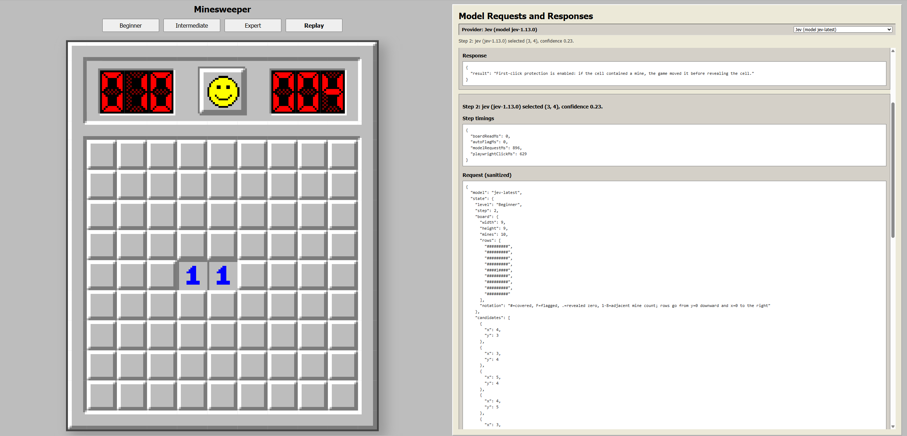
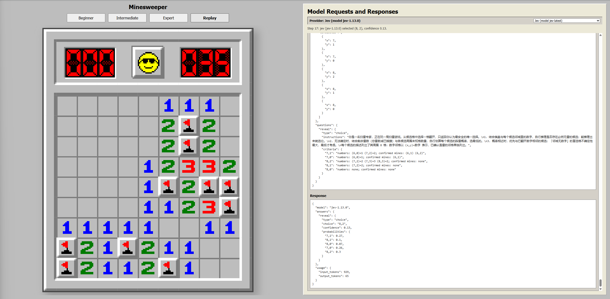

# jev-minesweeper

[English](./README.md) | 简体中文

这是一个 LLM 扫雷实验项目：由 **Jev** 或任意 **OpenAI 兼容模型** 通过真实 Chrome DOM 点击对局，页面右侧实时显示每一步的脱敏请求与返回。两个决策方共享相同的决策指令、棋盘状态和候选信息，但分别适配各自的 API 请求与输出格式。

| 对局开始：中心安全开局，右侧为决策面板 | 通关：墨镜脸、自动插旗、完整请求记录 |
| --- | --- |
|  |  |

## 快速开始

```bash
npm install
npm install -g @playwright/cli
cp config/providers.example.yaml config/providers.yaml   # 填入 openai 的 base_url / model / api_key
node scripts/play-all.mjs --provider openai --level beginner
```

需要 Node.js 22.19+（`undici` 依赖的版本要求）、Google Chrome 与全局 `@playwright/cli`。自动化通过 Playwright CLI 的 `click`/`eval` 操作真实 Chrome 页面。


## 常用命令

```bash
node scripts/play-all.mjs --provider jev --level beginner      # Jev 对局
node scripts/play-all.mjs --provider openai --level beginner   # OpenAI 兼容接口对局
node scripts/play-all.mjs --level beginner                     # 使用 yaml 里的 default_provider
npm test                                                        # 无密钥冒烟，验证三个等级
node scripts/play-all.mjs --verify --level beginner            # 无密钥冒烟，只验证一个等级
```

`--level` 可选 `beginner` / `intermediate` / `expert`，省略则三个等级连打。`--verify` 每个等级只执行一次已知安全的真实 DOM 点击，不调用模型。正式 provider 对局会自动中心开局、给推导出的确定雷插旗、在只剩一个候选时本地直选，直到通关、踩雷或达到步数上限；模型决策具有概率性，不保证每局通关。

如果上次运行被中断，固定的 Playwright 会话可能仍停留在旧页面。普通命令现在会自动关闭旧会话；只有确实要继续已有浏览器会话时才使用 `--reuse-session`。

## 配置 config/providers.yaml

| 配置 | 说明 |
| --- | --- |
| `default_provider` | `jev` 或 `openai`，命令行 `--provider` 优先 |
| `jev.endpoint` / `model` / `api_key` | 密钥留空时读环境变量 `TYPESAFE_API_KEY`、`JEV_API_KEY` |
| `openai.base_url` / `model` / `api_key` | 任意 OpenAI 兼容端点；`api_key` 也可用 `api_key_env` 指向环境变量 |
| `openai.temperature` / `json_mode` | 默认 0 / true（`json_mode: false` 适配不带 `response_format` 的端点） |
| `request.attempts` / `proxy` | 网络重试次数与代理；`JEV_REQUEST_ATTEMPTS`、`JEV_PROXY`、`HTTPS_PROXY` 等环境变量优先 |

## 可调环境变量

```bash
JEV_MAX_STEPS=800            # 模型步数上限，默认打完整局
JEV_MIN_CONFIDENCE=0.2      # 置信度下限，低于即终止
JEV_CANDIDATE_LIMIT=12      # 每步交给模型的候选数
JEV_REVIEW_MS=0             # 等待 Replay 直到手动关闭浏览器；正数可限制等待时长
```

## 输出
- `artifacts/run-report.json`：每局 provider、结果（cleared / mine / stopped）与耗时。
- `result/jev-时间戳.json`：每一步的完整脱敏请求与返回（不含任何密钥）。

`--verify` 的终端结果会显示为 `verified (1 safe click)`，表示点击链路验证成功，不代表完成了一局扫雷。

## 致谢

本项目的游戏代码导入自 [ziebelje/minesweeper](https://github.com/ziebelje/minesweeper)（作者 Jon Ziebell），在此基础上加入了 LLM 自动化，在此感谢原作者。
